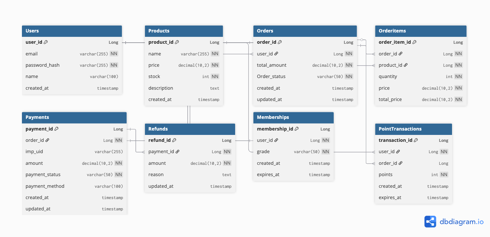

# 💯 포인트 기반 결제 시스템 프로젝트

## 📌 프로젝트 소개

본 프로젝트는 **PortOne Payments API(v2)** 기반으로 구현된  
**실제 결제 → 검증 → 후처리 → 취소 → 환불 이력 → 후처리 롤백**까지 전 과정을 포함한  
전자상거래형 결제 시스템입니다.

주문 · 결제 · 포인트 · 멤버십 · 재고 등 복잡한 도메인 간 의존성을 고려한  
실무형 아키텍처를 목표로 설계했습니다.

---

## 🎯 프로젝트 목표

- 실결제 연동(PortOne) 전체 플로우 완성
- 결제 완료 후 후처리 로직(재고, 포인트, 멤버십 등급) 안정화
- 결제 취소 후 롤백 처리(재고 복구, 포인트 회수, 멤버십 재계산) 구현
- CI/CD 파이프라인과 연계한 자동 배포
- WebFlux + JPA 혼합 환경에서 안정적인 트랜잭션 처리
- 복잡한 비즈니스 로직 구조화 역량 향상

---

## 🧩 기술 스택

- Java 17
- Spring Boot 3.x
- Spring MVC + Spring WebFlux(WebClient)
- Spring Security + JWT
- Spring Data JPA
- Lombok

### **사용 툴**

- MySQL 8.0
- AWS EC2 / S3 / GitHub Actions
- PortOne Payments API v2

---

## 비즈니스 로직 플로우차트


## ERD 설계



## 📁 프로젝트 디렉토리 구조

```
payment-system/
├── controller/          # API 진입점 (Auth, Orders, Payment)
├── service/             # 비즈니스 로직 계층
├── repository/          # Spring Data JPA
├── entity/              # 도메인 엔티티 (User, Order, Payment 등)
├── dto/                 # Request / Response DTO
├── client/              # PortOne API WebClient
├── global/              # JWT, Security, WebFlux, 예외 처리
├── config/              # PortOne 설정
├── exception/           # 커스텀 예외 처리
├── resources/
│   ├── static/          # 결제 JS, HTML 화면
│   ├── templates/       # Thymeleaf View
│   └── application.yml  # DB / PortOne 설정
├── scripts/             # 배포 스크립트
├── docs/                # 문서 및 API 예시
└── PaymentSystemApplication.java
```

---

## 🚀 주요 기능

### 1. 인증 및 인가

- JWT 기반 인증 시스템
- Access Token / Refresh Token 발급 및 갱신
- Spring Security를 통한 엔드포인트 보호
- 사용자 회원가입, 로그인, 로그아웃

### 2. 주문 관리

- 주문 생성 및 조회
- 주문 상태 관리 (PENDING_PAYMENT, COMPLETED, CANCELLED)
- 주문별 상품 정보 관리
- 재고 검증 및 차감

### 3. 결제 처리

- PortOne Payments API v2 연동
- 결제 검증 (금액, 상태 검증)
- 결제 완료 후 자동 후처리:
  - 재고 차감
  - 포인트 적립
  - 멤버십 등급 업데이트
- 결제 취소 및 환불 처리
- 취소 시 자동 롤백:
  - 재고 복구
  - 포인트 회수
  - 멤버십 등급 재계산

### 4. 포인트 시스템

- 결제 금액의 일정 비율 포인트 적립
- 멤버십 등급별 차등 적립률 적용
- 포인트 만료일 관리 (30일)
- 결제 취소 시 포인트 자동 회수
- 사용자별 포인트 잔액 조회

### 5. 멤버십 등급 시스템

- 등급 체계: NORMAL(1%), VIP(5%), VVIP(10%)
- 최근 90일 누적 결제 금액 기준 등급 결정
  - NORMAL: ~49,999원
  - VIP: 50,000원 ~ 99,999원
  - VVIP: 100,000원 이상
- 등급별 포인트 적립률 차등 적용
- 결제/취소 시마다 등급 자동 재계산

### 6. 재고 관리

- 주문 시 재고 검증
- 결제 완료 시 재고 차감
- 결제 취소 시 재고 복구

---

## 📡 API 엔드포인트

### 인증 (Authentication)

- `POST /api/auth/register` - 회원가입
- `POST /api/auth/login` - 로그인
- `POST /api/auth/logout` - 로그아웃
- `POST /api/auth/refresh` - 토큰 갱신

### 주문 (Orders)

- `POST /api/orders` - 주문 생성
- `GET /api/orders` - 주문 목록 조회 (PENDING_PAYMENT 상태만)
- `GET /api/orders/{orderId}` - 주문 상세 조회 (인증 필요)

### 결제 (Payments)

- `POST /api/payments/complete` - 결제 완료 검증
- `POST /api/payments/cancel` - 결제 취소
- `GET /api/payments/paid` - 결제 내역 조회

### 포인트 (Points)

- `GET /api/users/{userId}/points` - 사용자 포인트 조회

### 뷰 (View)

- `GET /` - 홈 페이지
- `GET /auth/register` - 회원가입 페이지
- `GET /auth/login` - 로그인 페이지
- `GET /payment/{orderId}` - 결제 페이지

---

## 🛠️ 환경 설정

### 필수 환경 변수

애플리케이션 실행을 위해 다음 환경 변수를 설정해야 합니다:

#### 데이터베이스 설정

```bash
SPRING_DATASOURCE_URL=jdbc:mysql://localhost:3306/mydb
SPRING_DATASOURCE_USERNAME=your_username
SPRING_DATASOURCE_PASSWORD=your_password
SPRING_DATASOURCE_DRIVER_CLASS_NAME=com.mysql.cj.jdbc.Driver
SPRING_JPA_HIBERNATE_DDL_AUTO=create  # 또는 update, validate
```

#### JWT 설정

```bash
JWT_SECRET=your_jwt_secret_key
JWT_ACCESS_TOKEN_EXPIRATION=3600000  # 1시간 (밀리초)
JWT_REFRESH_TOKEN_EXPIRATION=604800000  # 7일 (밀리초)
```

#### PortOne API 설정

```bash
PORTONE_API_SECRET=your_portone_api_secret
PORTONE_API_URL=https://api.portone.io/
PORTONE_STORE_ID=your_store_id
PORTONE_CHANNEL_KEY=your_channel_key
PORTONE_PG_MID=INIpayTest
PORTONE_WEB_SIGNKEY=your_web_signkey
PORTONE_INI_API_KEY=your_ini_api_key
PORTONE_INI_API_IV=your_ini_api_iv
PORTONE_WEBHOOK_SECRET=your_webhook_secret
```

---

## 💻 로컬 개발 환경 설정

### 1. 사전 요구사항

- Java 17 이상
- MySQL 8.0
- Gradle (또는 Gradle Wrapper 사용)

### 2. 데이터베이스 설정

```sql
CREATE DATABASE mydb CHARACTER SET utf8mb4 COLLATE utf8mb4_unicode_ci;
```

### 3. 환경 변수 설정

`.env` 파일을 생성하거나 시스템 환경 변수로 설정:

```bash
export SPRING_DATASOURCE_USERNAME=root
export SPRING_DATASOURCE_PASSWORD=your_password
export JWT_SECRET=your_secret_key
# ... 기타 환경 변수
```

### 4. 애플리케이션 실행

```bash
# Gradle Wrapper 사용
./gradlew bootRun

# 또는 빌드 후 실행
./gradlew build
java -jar build/libs/payment-system-0.0.1-SNAPSHOT.jar
```

애플리케이션은 기본적으로 `http://localhost:8080`에서 실행됩니다.

---

## 🐳 Docker를 사용한 실행

### 1. Docker 이미지 빌드

```bash
docker build -t payment-system:latest .
```

### 2. Docker Compose 사용 (권장)

`docker-compose.yml` 파일을 생성하여 MySQL과 함께 실행:

```yaml
version: "3.8"
services:
  mysql:
    image: mysql:8.0
    environment:
      MYSQL_ROOT_PASSWORD: rootpassword
      MYSQL_DATABASE: mydb
    ports:
      - "3306:3306"

  app:
    build: .
    ports:
      - "8080:8080"
    environment:
      SPRING_DATASOURCE_URL: jdbc:mysql://mysql:3306/mydb
      SPRING_DATASOURCE_USERNAME: root
      SPRING_DATASOURCE_PASSWORD: rootpassword
    depends_on:
      - mysql
```

### 3. 컨테이너 실행

```bash
docker-compose up -d
```

---

## 🔄 CI/CD 파이프라인

프로젝트는 GitHub Actions를 사용한 CI/CD 파이프라인을 구축했습니다.

### CI (Continuous Integration)

- `.github/workflows/ci.yml`
- 코드 빌드 및 테스트
- Docker 이미지 빌드 및 Docker Hub 푸시

### CD (Continuous Deployment)

- `.github/workflows/cd.yml`
- CI 성공 시 자동으로 EC2에 배포
- Docker 컨테이너 기반 배포
- 무중단 배포 지원

### 배포 프로세스

1. 코드 푸시 → GitHub Actions 트리거
2. 빌드 및 테스트 실행
3. Docker 이미지 빌드 및 푸시
4. EC2 서버에 SSH 접속
5. 기존 컨테이너 중지 및 제거
6. 최신 이미지 Pull 및 실행
7. 헬스 체크 및 검증

---

## 📊 데이터베이스 스키마

### 주요 엔티티

- **User**: 사용자 정보 (이메일, 비밀번호, 이름)
- **Order**: 주문 정보 (총 금액, 상태)
- **OrderItem**: 주문 상품 정보
- **Payment**: 결제 정보 (imp_uid, 금액, 상태, 결제 수단)
- **Refund**: 환불 이력
- **PointTransaction**: 포인트 거래 내역
- **MemberShip**: 멤버십 정보 (등급, 누적 금액, 만료일)
- **Product**: 상품 정보 (가격, 재고)

자세한 ERD는 프로젝트 루트의 `ERD.png` 파일을 참조하세요.

---

## 🔐 보안 기능

- **JWT 인증**: Access Token과 Refresh Token을 통한 인증
- **Spring Security**: 엔드포인트별 인증/인가 설정
- **비밀번호 해싱**: BCrypt를 통한 비밀번호 암호화
- **CORS 설정**: Cross-Origin 요청 처리
- **예외 처리**: 전역 예외 핸들러를 통한 일관된 에러 응답

---

## 🧪 테스트

### API 테스트

`docs/curl-examples.md` 파일에 curl 명령어 예시가 포함되어 있습니다.

### 주요 테스트 시나리오

1. 사용자 회원가입 및 로그인
2. 주문 생성
3. 결제 완료 및 검증
4. 포인트 적립 확인
5. 멤버십 등급 업데이트 확인
6. 결제 취소 및 롤백 확인

---

## 📝 주요 비즈니스 로직

### 결제 완료 플로우

1. PortOne에서 결제 완료 후 `imp_uid` 수신
2. PortOne API를 통한 결제 검증 (금액, 상태)
3. 결제 정보 DB 저장
4. 주문 상태 업데이트 (COMPLETED)
5. 후처리 실행:
   - 재고 차감 (`ProductService`)
   - 포인트 적립 (`PointService`)
   - 멤버십 등급 업데이트 (`MemberShipService`)

### 결제 취소 플로우

1. PortOne API를 통한 결제 취소 요청
2. 결제 상태 업데이트 (REFUNDED)
3. 주문 상태 업데이트 (CANCELLED)
4. 롤백 처리:
   - 재고 복구
   - 포인트 회수
   - 멤버십 등급 재계산
5. 환불 이력 기록

---

## 🚨 예외 처리

프로젝트는 커스텀 예외를 통해 비즈니스 로직 오류를 처리합니다:

- `EmailAlreadyExistException`: 중복 이메일
- `InvalidatePasswordException`: 잘못된 비밀번호
- `InvalidProductQuantityException`: 재고 부족
- `NotFoundException`: 리소스 없음
- `UnauthorizedActionException`: 권한 없음

모든 예외는 `GlobalExceptionHandler`를 통해 일관된 형식으로 응답됩니다.

---

## 📚 추가 문서

- `docs/curl-examples.md`: API 테스트용 curl 명령어 예시
- `docs/dbdiagram.md`: 데이터베이스 다이어그램
- `docs/images/payment_flow.png`: 결제 플로우 차트

---

## 🤝 기여 가이드

1. Fork the repository
2. Create your feature branch (`git checkout -b feature/AmazingFeature`)
3. Commit your changes (`git commit -m 'Add some AmazingFeature'`)
4. Push to the branch (`git push origin feature/AmazingFeature`)
5. Open a Pull Request

---

## 📄 라이선스

이 프로젝트는 교육 목적으로 제작되었습니다.

---

## 👥 개발자

Sparta Payment System Team
